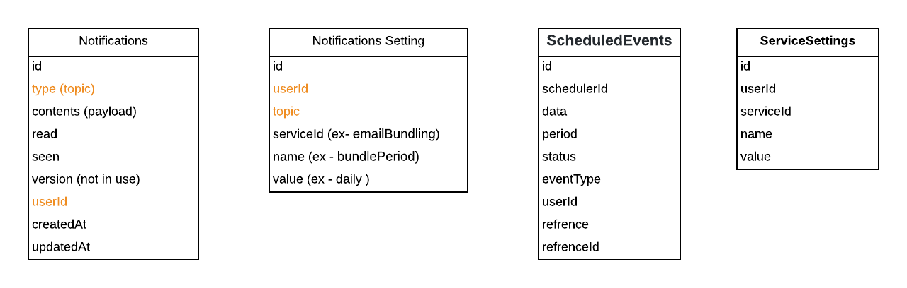

# Webscoket requirements 

Need websocket support in for this micro-service so that front-end will be updated immediately once the new 'corresponding' 
message will be consumed/received from Cloud-Kafka.
In a general sense, need to support `push` mechanisim instead of `polling` as per below diagram. 

**Background** - This is general notification service, which is converting related trigger event into user notifications.

Our other micro-services are triggering (publishing) `event` in coressponding `Cloud-Kafka` topics. This service subscribes 
all coressponding Cloud-Kafka topcis. After consuming an event message from a particular topic, this service is generating user 
notifications by doing `post-consumer-operation`, kind of `one-to-many` scenario. Example - any update in `challenge` need to 
be notified to all registered participants.    
